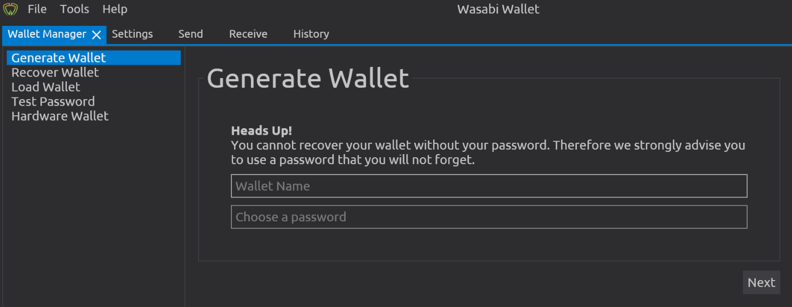
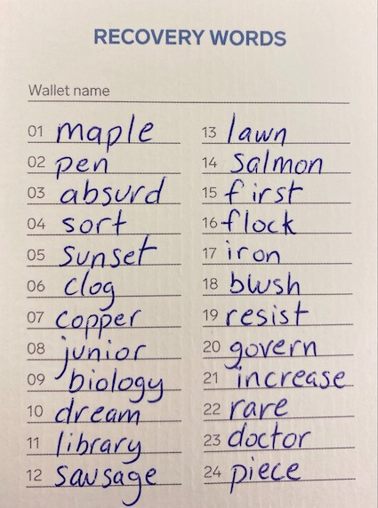

# Création du portefeuille - Sauvegarde

Vous devez créer une sauvegarde, la cacher puis vous assurer de ne pas la stocker au même endroit où vous conservez votre phrase secrète.

1. Cliquez sur le bouton **** « Next ». Une série de mots sera générée.
2. Prenez votre temps et notez les mots correctement. Assurez-vous que les mots sont facilement lisibles et dans le bon ordre.
3. Écrivez le numéro devant chaque mot, afin de vous assurer de savoir quel est le bon ordre.
4. <mark style="color:red;">**Vérifiez à trois reprises pour vous en assurer.**</mark>
5. <mark style="color:red;">**Vérifiez à trois reprises pour vous en assurer.**</mark>
6. <mark style="color:red;">**Vérifiez à trois reprises pour vous en assurer.**</mark>
7. Trouvez un moyen sûr de stocker la sauvegarde. Soyez créatif!
   * Vous pouvez faire deux sauvegardes et les stocker dans des endroits différents.


Si Wasabi Wallet cesse soudainement ses activités et supprime son application du marché, le fait d'avoir votre sauvegarde vous permettra tout de même d'avoir accès à vos fonds.


9\. Wasabi Wallet vous demandera d'entrer votre mot de passe à nouveau pour vérifier que vous le connaissez.

10\. Une fois que la sauvegarde est notée et que votre mot de passe est validé, cliquez sur « Load Wallet ».

### **Vous avez maintenant un portefeuille Bitcoin!**

