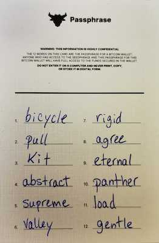

# Création du portefeuille - Phrase secrète

L'étape suivante consiste à choisir un nom et un mot de passe pour le portefeuille Bitcoin. Wasabi utilise également votre mot de passe comme phrase secrète : un 13e mot à votre sauvegarde de 12 mots. Avant de les choisir, lisez ci-dessous pour apprendre les notions de sécurité du mot de passe.

.png>)


Bien que Wasabi Wallet utilise le terme "mot de passe", l'application fait référence à une phrase secrète.


## ⛔️ <mark style="color:red;">ATTENTION ! Vous devez choisir le bon mot de passe pour votre portefeuille. Pas de presse! N'ignorez pas cette section!</mark>

### Notions de sécurité de base de la phrase secrète

* Notez la phrase secrète que vous voulez utiliser avant de la taper sur votre ordinateur.
* Utilisez une combinaison de mots comme phrase secrète, cela facilite la mémorisation.
* Utilisez 12 caractères pour votre phrase secrète. Pour une sécurité accrue, utilisez 24 caractères.&#x20;
* Le phrase secrète est requise chaque fois que vous voulez utiliser l'application.
* Si quelqu'un a accès à votre ordinateur, la phrase secrète préviendra le vol de vos fonds.
* Idéalement, créez une phrase secrète unique que nul ne puisse deviner mais dont vous vous souviendrez.
* Si vous perdez la phrase secrète, vous perdez l'accès à vos bitcoins à jamais.
* Vous ne pouvez pas modifier votre phrase secrète, si vous désirez la modifier, vous devrez recommencer le processus à nouveau.
* La phrase secrète est nécessaire à la récupération de l'accès à vos bitcoins si l'ordinateur est endommagé, volé, ou perdu.
* Conseil de pro : le nom de votre portefeuille sert principalement à des fins de comptabilité et à la traçabilité de vos transactions si vous avez plusieurs portefeuilles. Ce nom n'a pas d'importance particulière et ne sera pas partagé avec qui que ce soit.

#### **Lisez sur les** [<mark style="color:red;">**m**</mark><mark style="color:red;">eilleures pratiques de phrase secrète</mark>](https://docs.wasabiwallet.io/using-wasabi/PasswordBestPractices.html) <mark style="color:red;"></mark> **si vous n'êtes pas certain de savoir comment bien vous y prendre.**&#x20;

