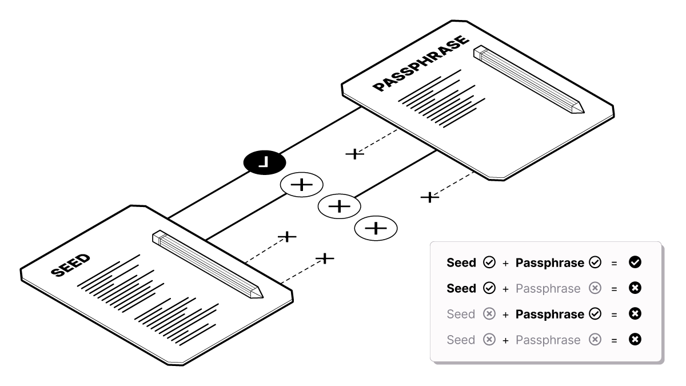

# AVERTISSEMENT! Notions importantes à savoir avant de configurer une sauvegarde

## ⛔️  <mark style="color:red;">C'EST LA PARTIE LA PLUS IMPORTANTE</mark><mark style="color:red;">**. PRENEZ LE TEMPS DE LIRE CES INSTRUCTIONS AU COMPLET. NE PAS IGNORER.⛔️**</mark>

L'étape suivante consiste à créer une sauvegarde papier de votre portefeuille Bitcoin, laquelle vous sera nécessaire pour récupérer l'accès à vos bitcoins si votre ordinateur est endommagé, perdu, ou volé.

La sauvegarde consiste en une série de mots générés aléatoirement par le portefeuille Bitcoin.

**Ces mots, en combinaison avec votre phrase secrète, vous permettent de récupérer l'accès aux clés de votre portefeuille Bitcoin en cas de perte.**


### <mark style="color:red;">**Il y a 5 règles pour la création d'une sauvegarde Bitcoin;**</mark>

1. Si vous n'avez pas de sauvegarde et que vous perdez l'accès à Wasabi Wallet sur votre ordinateur, **** vous perdrez l'accès aux bitcoins en permanence.
2. Si vous disposez d'une sauvegarde mais vous oubliez le mot de passe, vous perdrez l'accès aux bitcoins en permanence.
3. Si quelqu'un trouve la sauvegarde de votre portefeuille, vos fonds ne peuvent pas être volés à moins que cette personne connaisse aussi votre phrase secrète.
4. Ne stockez jamais votre phrase secrète au même endroit que votre sauvegarde. Si quelqu'un trouve votre sauvegarde et connait en plus votre phrase secrète, vos bitcoins leurs seront accessibles.

## <mark style="color:red;">5. Ne prenez pas de photo, n'imprimez pas et ne partagez pas vos mots!</mark>


